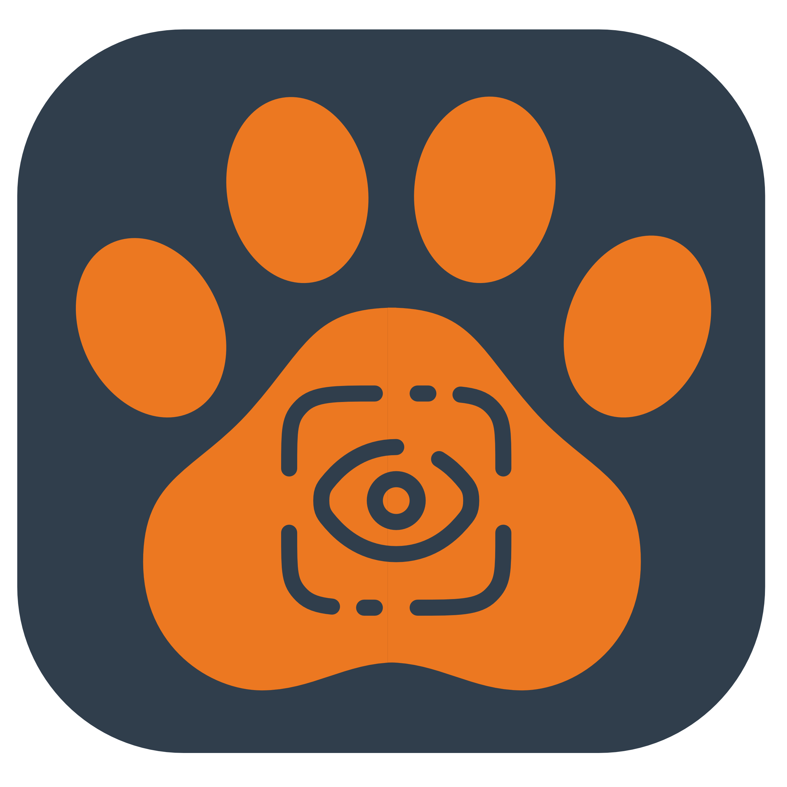

<p align="center">
  
</p>

<h1 align="center">Aslan Browser</h1>

<p align="center">
  <strong>A native macOS browser built for AI agents.</strong><br>
  WKWebView + Unix socket + JSON-RPC = fast, simple browser automation without Chrome or CDP.
</p>

<p align="center">
  
  
  
  
</p>

---

## Why Aslan?

Existing browser automation (Puppeteer, Playwright, Selenium) wasn't built for AI agents. They're slow, heavy, and produce bloated DOM trees that burn tokens.

Aslan Browser is different:

- **🦁 Native macOS** — WKWebView, not Chrome. No 500MB browser download.
- **⚡ Fast** — Sub-2ms JS eval, sub-30ms screenshots. Unix socket, not HTTP.
- **🌳 Accessibility-tree-first** — 10–100× fewer tokens than raw DOM for the same page.
- **🐍 Zero-dependency Python SDK** — Only stdlib (`socket`, `json`, `asyncio`, `base64`).
- **🔌 Simple protocol** — NDJSON JSON-RPC 2.0. Build a client in any language in an afternoon.

---

## Table of Contents

- [Quickstart](#quickstart)
- [Installation](#installation)
  - [Option A: Build from Source](#option-a-build-from-source)
  - [Option B: Download Pre-built Binary](#option-b-download-pre-built-binary)
- [Python SDK](#python-sdk)
- [Usage Examples](#usage-examples)
- [API Reference](#api-reference)
- [Architecture](#architecture)
- [Performance](#performance)
- [Project Structure](#project-structure)
- [Development](#development)
- [License](#license)

---

## Quickstart

```python
from aslan_browser import AslanBrowser

with AslanBrowser() as browser:
    # Navigate and wait for the page to be ready
    browser.navigate("https://github.com/login", wait_until="idle")

    # Get the accessibility tree — this is what you send to the LLM
    tree = browser.get_accessibility_tree()
    for node in tree:
        print(f"{node['ref']} {node['role']} \"{node['name']}\"")
    # @e0 textbox "Username or email address"
    # @e1 textbox "Password"
    # @e2 button "Sign in"

    # Interact using @eN refs from the tree
    browser.fill("@e0", "myusername")
    browser.fill("@e1", "mypassword")
    browser.click("@e2")

    # Screenshot for vision models
    browser.save_screenshot("page.jpg")
```

That's it. Navigate, read the tree, act on refs.

---

## Installation

### Prerequisites

| Requirement | Version | Check |
|---|---|---|
| macOS | 15.0+ (Sequoia) | `sw_vers` |
| Xcode | 16+ (Swift 6.2) | `xcodebuild -version` |
| Python | 3.10+ | `python3 --version` |

### Option A: Build from Source

**1. Clone and build the macOS app**

```bash
git clone https://github.com/onorbumbum/aslan-browser.git
cd aslan-browser

# Build with Xcode
xcodebuild build \
  -scheme aslan-browser \
  -configuration Debug \
  -derivedDataPath .build
```

The app will be at `.build/Build/Products/Debug/aslan-browser.app`.

**2. Install the Python SDK**

```bash
cd sdk/python
pip install -e .
```

**3. Start the browser**

```bash
# Visible window (for development / debugging)
.build/Build/Products/Debug/aslan-browser.app/Contents/MacOS/aslan-browser

# Hidden window (for production / CI)
.build/Build/Products/Debug/aslan-browser.app/Contents/MacOS/aslan-browser --hidden
```

The app listens on `/tmp/aslan-browser.sock` — your Python code connects there automatically.

**4. Verify it works**

```bash
python3 -c "
from aslan_browser import AslanBrowser
with AslanBrowser() as b:
    b.navigate('https://example.com')
    print('Title:', b.get_title())
    print('Nodes:', len(b.get_accessibility_tree()))
"
```

### Option B: Download Pre-built Binary

> **Coming soon** — Pre-built `.app` bundles will be available on the [Releases](https://github.com/onorbumbum/aslan-browser/releases) page.

Once downloaded:

```bash
# Move to Applications (optional)
cp -r Aslan\ Browser.app /Applications/

# Start the browser
/Applications/Aslan\ Browser.app/Contents/MacOS/aslan-browser --hidden

# Install the Python SDK
pip install aslan-browser
```

---

## Python SDK

### Install

```bash
pip install aslan-browser    # from PyPI (coming soon)
# or
pip install -e sdk/python    # from source
```

### Sync Client

```python
from aslan_browser import AslanBrowser

with AslanBrowser() as browser:
    browser.navigate("https://example.com")
    tree = browser.get_accessibility_tree()
    data = browser.screenshot()
```

### Async Client

```python
from aslan_browser import AsyncAslanBrowser

async with AsyncAslanBrowser() as browser:
    await browser.navigate("https://example.com")
    tree = await browser.get_accessibility_tree()
    data = await browser.screenshot()
```

### Event Handling (Async)

```python
async with AsyncAslanBrowser() as browser:
    def on_event(msg):
        print(f"Event: {msg['method']} → {msg.get('params', {})}")

    browser.on_event(on_event)
    await browser.navigate("https://example.com")
```

### Custom Socket Path

```python
browser = AslanBrowser(socket_path="/tmp/my-custom.sock")
```

---

## Usage Examples

### 🌳 Agent Workflow: Read → Decide → Act

The core loop for any AI agent:

```python
from aslan_browser import AslanBrowser

with AslanBrowser() as browser:
    browser.navigate("https://news.ycombinator.com", wait_until="idle")

    # 1. Read — get the accessibility tree
    tree = browser.get_accessibility_tree()

    # 2. Send to LLM (tree is a compact list of interactive elements)
    # Each node: {"ref": "@e0", "role": "link", "name": "Show HN: ...", "rect": {...}}

    # 3. Act — use the ref the LLM picks
    browser.click("@e5")  # click the 5th element
```

### 📸 Screenshot for Vision Models

```python
# JPEG bytes — send directly to GPT-4V, Claude, etc.
jpeg_bytes = browser.screenshot(quality=70)

# Or save to disk
browser.save_screenshot("page.jpg", quality=85, width=1440)
```

### 🗂️ Multi-Tab Browsing

```python
with AslanBrowser() as browser:
    # Default tab0 is created on launch
    tab1 = browser.tab_create(url="https://google.com")
    tab2 = browser.tab_create(url="https://github.com")

    # Work with specific tabs
    browser.navigate("https://example.com", tab_id="tab0")
    tree1 = browser.get_accessibility_tree(tab_id=tab1)
    tree2 = browser.get_accessibility_tree(tab_id=tab2)

    # List all tabs
    tabs = browser.tab_list()

    # Close when done
    browser.tab_close(tab1)
    browser.tab_close(tab2)
```

### 🚀 Batch Operations (Multi-Agent)

Execute multiple operations in a single round-trip:

```python
with AslanBrowser() as browser:
    tab1 = browser.tab_create(url="https://google.com")
    tab2 = browser.tab_create(url="https://github.com")

    # Navigate multiple tabs at once
    results = browser.parallel_navigate({
        tab1: "https://news.ycombinator.com",
        tab2: "https://reddit.com",
    })

    # Get all accessibility trees in one call
    trees = browser.parallel_get_trees([tab1, tab2])

    # Screenshot all tabs at once
    screenshots = browser.parallel_screenshots([tab1, tab2])
```

### 🔑 Sessions (Agent Isolation)

```python
with AslanBrowser() as browser:
    # Create isolated sessions for different agents
    session1 = browser.session_create(name="agent-research")
    session2 = browser.session_create(name="agent-shopping")

    # Tabs belong to sessions
    tab_a = browser.tab_create(url="https://google.com", session_id=session1)
    tab_b = browser.tab_create(url="https://amazon.com", session_id=session2)

    # List tabs for a session
    research_tabs = browser.tab_list(session_id=session1)

    # Destroy session → closes all its tabs
    browser.session_destroy(session1)
```

### 🍪 Cookie Management

```python
with AslanBrowser() as browser:
    # Set a cookie before navigating
    browser.set_cookie(
        name="session",
        value="abc123",
        domain=".example.com",
    )
    browser.navigate("https://example.com")

    # Read cookies
    cookies = browser.get_cookies(url="https://example.com")
```

### ⌨️ Keyboard & Forms

```python
with AslanBrowser() as browser:
    browser.navigate("https://example.com/search")

    # Fill a form field
    browser.fill("@e1", "search query")

    # Press Enter
    browser.keypress("Enter")

    # Keyboard shortcuts
    browser.keypress("a", modifiers={"meta": True})  # Cmd+A

    # Select from dropdown
    browser.select("@e3", "option-value")

    # Scroll
    browser.scroll(x=0, y=500)  # scroll down 500px
```

### 🔧 Direct JavaScript

```python
with AslanBrowser() as browser:
    browser.navigate("https://example.com")

    # Evaluate JS and get the result
    count = browser.evaluate("return document.querySelectorAll('a').length")
    print(f"Found {count} links")

    # With arguments
    result = browser.evaluate(
        "return document.querySelector(sel).textContent",
        args={"sel": "h1"}
    )
```

---

## API Reference

All methods default to `tab_id="tab0"` for single-tab usage.

### Navigation

| Method | Description |
|---|---|
| `navigate(url, tab_id, wait_until, timeout)` | Navigate to URL. `wait_until`: `"none"`, `"load"`, `"idle"` |
| `go_back(tab_id)` | Navigate back |
| `go_forward(tab_id)` | Navigate forward |
| `reload(tab_id)` | Reload the page |
| `wait_for_selector(selector, tab_id, timeout)` | Wait for a CSS selector to appear |

### Page Info

| Method | Description |
|---|---|
| `get_title(tab_id)` | Get page title |
| `get_url(tab_id)` | Get current URL |
| `evaluate(script, tab_id, args)` | Execute JavaScript, return result |

### Accessibility Tree

| Method | Description |
|---|---|
| `get_accessibility_tree(tab_id)` | Extract the accessibility tree as a flat list |

Each node returns:
```json
{"ref": "@e0", "role": "link", "name": "Click me", "rect": {"x": 10, "y": 50, "w": 80, "h": 24}}
```

Use `ref` values (`@e0`, `@e1`, ...) in `click()`, `fill()`, etc.

### Interaction

| Method | Description |
|---|---|
| `click(target, tab_id)` | Click by `@eN` ref or CSS selector |
| `fill(target, value, tab_id)` | Fill an input field |
| `select(target, value, tab_id)` | Select a dropdown option |
| `keypress(key, tab_id, modifiers)` | Send a keypress (`"Enter"`, `"Tab"`, etc.) |
| `scroll(x, y, target, tab_id)` | Scroll the page or an element |

### Screenshots

| Method | Description |
|---|---|
| `screenshot(tab_id, quality, width)` | Take screenshot, returns JPEG `bytes` |
| `save_screenshot(path, tab_id, quality, width)` | Save screenshot to file |

### Cookies

| Method | Description |
|---|---|
| `get_cookies(tab_id, url)` | Get cookies, optionally filtered by URL |
| `set_cookie(name, value, domain, path, expires, tab_id)` | Set a cookie |

### Tab Management

| Method | Description |
|---|---|
| `tab_create(url, width, height, hidden, session_id)` | Create a new tab, returns tab ID |
| `tab_close(tab_id)` | Close a tab |
| `tab_list(session_id)` | List all open tabs |

### Sessions

| Method | Description |
|---|---|
| `session_create(name)` | Create a named session, returns session ID |
| `session_destroy(session_id)` | Destroy session and close all its tabs |

### Batch / Parallel

| Method | Description |
|---|---|
| `batch(requests)` | Execute multiple JSON-RPC calls in one round-trip |
| `parallel_navigate(urls, wait_until)` | Navigate multiple tabs simultaneously |
| `parallel_get_trees(tab_ids)` | Get accessibility trees from multiple tabs |
| `parallel_screenshots(tab_ids, quality, width)` | Screenshot multiple tabs at once |

---

## Architecture

```
┌──────────────────┐    Unix Socket    ┌──────────────────────────────────────┐
│  Python SDK      │◄─────────────────►│  aslan-browser.app (macOS native)   │
│  (or any client) │   NDJSON JSON-RPC │                                      │
└──────────────────┘                   │  SocketServer (SwiftNIO)             │
                                       │  └─ JSONRPCHandler                   │
                                       │     └─ MethodRouter                  │
                                       │        └─ TabManager                 │
                                       │           └─ BrowserTab              │
                                       │              ├─ WKWebView            │
                                       │              └─ ScriptBridge (JS)    │
                                       └──────────────────────────────────────┘
```

### Key Design Decisions

| Decision | Choice | Why |
|---|---|---|
| Rendering engine | **WKWebView** | macOS native, no Chrome dependency, full JS/WebSocket support |
| Server | **SwiftNIO + Unix socket** | ~30% faster than TCP for local IPC, no port conflicts |
| Protocol | **NDJSON JSON-RPC 2.0** | Language-agnostic, simple, one message per line |
| Window strategy | **Hidden NSWindow per tab** | Invisible but in window hierarchy so JS/WebSockets work normally |
| Page representation | **Accessibility tree** | 10–100× fewer tokens than raw DOM for equivalent information |

### How the Accessibility Tree Works

The injected JavaScript (`ScriptBridge.swift`) walks the DOM and produces a flat list of interactive/semantic elements:

1. **Traverses** all visible DOM elements
2. **Filters** to interactive elements (links, buttons, inputs, selects) + ARIA landmarks
3. **Assigns** stable `@eN` refs and tags elements with `data-agent-ref` attributes
4. **Resolves** names via: `aria-label` → `aria-labelledby` → `<label>` → `placeholder` → `title` → `textContent`
5. **Includes** bounding rects for spatial reasoning

When you call `click("@e3")`, the browser finds the element with `data-agent-ref="@e3"` and dispatches the event.

---

## Performance

Benchmarked on Apple Silicon (M-series). Run benchmarks yourself:

```bash
# Start the app first, then:
python3 benchmarks/benchmark.py
```

| Benchmark | Target | Typical Result |
|---|---|---|
| JS eval round-trip (`1+1`) | < 2ms | ~0.5ms |
| Screenshot (1440w, JPEG q70) | < 30ms | ~15ms |
| Accessibility tree (simple page) | < 50ms | ~5ms |
| Accessibility tree (complex page) | < 50ms | ~20ms |

### vs. Puppeteer/CDP

| Operation | Aslan Browser | Puppeteer + Chrome |
|---|---|---|
| JS eval round-trip | ~0.5ms | 2–5ms |
| Screenshot | ~15ms | 50–150ms |
| Memory per tab | ~40MB | ~80–150MB |
| Cold start | < 500ms | 2–5s |
| Page representation | A11y tree (compact) | Full DOM (bloated) |

---

## Project Structure

```
aslan-browser/
├── aslan-browser/              # Swift source (AppKit + SwiftNIO)
│   ├── AppDelegate.swift       # App lifecycle, menu, starts server
│   ├── BrowserTab.swift        # WKWebView wrapper, navigation, screenshots
│   ├── TabManager.swift        # Tab lifecycle, session management
│   ├── SocketServer.swift      # SwiftNIO Unix socket listener
│   ├── JSONRPCHandler.swift    # JSON-RPC 2.0 parser + response builder
│   ├── MethodRouter.swift      # Maps JSON-RPC methods → BrowserTab calls
│   ├── ScriptBridge.swift      # Injected JS: a11y tree, readiness, interaction
│   └── Models/
│       ├── RPCMessage.swift    # JSON-RPC request/response types
│       ├── A11yNode.swift      # Accessibility tree node
│       ├── BrowserError.swift  # Error codes
│       └── TabInfo.swift       # Tab metadata
├── sdk/
│   └── python/                 # Python SDK
│       ├── aslan_browser/
│       │   ├── client.py       # Sync client
│       │   └── async_client.py # Async client
│       ├── tests/
│       └── pyproject.toml
├── benchmarks/
│   ├── benchmark.py            # Performance benchmarks
│   └── complex_page.html       # Test page for benchmarking
├── tests/                      # Integration tests
├── docs/                       # Design docs & phase plans
├── assets/                     # Logo and images
└── aslan-browser.xcodeproj     # Xcode project
```

**~2,000 lines of Swift. ~600 lines of Python. Two external dependencies (SwiftNIO).**

---

## Development

### Build & Run

```bash
# Build
xcodebuild build -scheme aslan-browser -configuration Debug -derivedDataPath .build

# Run (visible)
.build/Build/Products/Debug/aslan-browser.app/Contents/MacOS/aslan-browser

# Run (hidden)
.build/Build/Products/Debug/aslan-browser.app/Contents/MacOS/aslan-browser --hidden
```

### Run Tests

```bash
# Start the app first, then:
cd sdk/python
pip install -e ".[dev]"
python3 -m pytest tests/ -v
```

### Run Benchmarks

```bash
# Start the app first, then:
python3 benchmarks/benchmark.py
```

### Build a Release Binary

```bash
xcodebuild build \
  -scheme aslan-browser \
  -configuration Release \
  -derivedDataPath .build

# The release app is at:
# .build/Build/Products/Release/aslan-browser.app
```

To distribute the `.app` bundle, you can zip it:

```bash
cd .build/Build/Products/Release
zip -r aslan-browser-macos.zip aslan-browser.app
```

---

## Troubleshooting

### "Socket not found" error

The app isn't running. Start it first:

```bash
.build/Build/Products/Debug/aslan-browser.app/Contents/MacOS/aslan-browser --hidden
```

### "Connection refused" error

Another instance may be running. Kill it and restart:

```bash
pkill -f aslan-browser
rm -f /tmp/aslan-browser.sock
# Then restart the app
```

### Blank screenshots

WKWebView requires a window hierarchy to render. Make sure you're using the app (not trying to run headless without it). The `--hidden` flag hides the window but keeps it in the hierarchy.

### Sites detecting automation

Aslan Browser uses a Chrome-compatible User-Agent string by default. Some sites may still detect automation. You can customize the User-Agent via:

```python
browser.evaluate("""
    Object.defineProperty(navigator, 'userAgent', {
        get: () => 'your-custom-user-agent'
    });
""")
```

---

## JSON-RPC Protocol (For Non-Python Clients)

Connect to the Unix socket at `/tmp/aslan-browser.sock` and send newline-delimited JSON-RPC 2.0:

```bash
# Example with socat
echo '{"jsonrpc":"2.0","id":1,"method":"navigate","params":{"tabId":"tab0","url":"https://example.com"}}' | \
  socat - UNIX-CONNECT:/tmp/aslan-browser.sock
```

Every request is a single JSON line. Every response is a single JSON line. Notifications (events) are pushed as JSON lines without an `id` field.

See the [Python SDK source](sdk/python/aslan_browser/client.py) for a complete client implementation — it's under 300 lines with zero dependencies.

---

## Roadmap

- [ ] Pre-built binaries on GitHub Releases
- [ ] `pip install aslan-browser` on PyPI
- [ ] Content blocking (ad/tracker filtering via `WKContentRuleList`)
- [ ] PDF text extraction
- [ ] Network request visibility (URL-level via fetch/XHR monkey-patching)
- [ ] File download handling
- [ ] Node.js / TypeScript SDK
- [ ] Auto-launch: SDK starts the app if it's not running

---

## License

MIT License. See [LICENSE](LICENSE) for details.

---

<p align="center">
  <strong>Aslan</strong> — named after the lion. Fast, native, and built for agents. 🦁
</p>
